Introduction
============

Currency Cloud Connect is designed for businesses that want to make
international payments. By accessing our Payment Engine via our API, you can
automate your end-to-end payment processes and rapidly deliver
tailor-made solutions for your customers.

Our API is built by developers for developers, making it straightforward
to integrate with our systems.

In order to use the API demo, you must register for an API key at
<https://connect.currencycloud.com/api-register>.

Postman and setup
=================

Installation
------------

Postman is a Google Chrome App that allows you to quickly use and test
API calls with our system, with features that help to streamline and
efficiate your calls.

To download Postman, simply follow [this
link](https://chrome.google.com/webstore/detail/postman-rest-client-packa/fhbjgbiflinjbdggehcddcbncdddomop?hl=en)
and click on “Add to Chrome”.

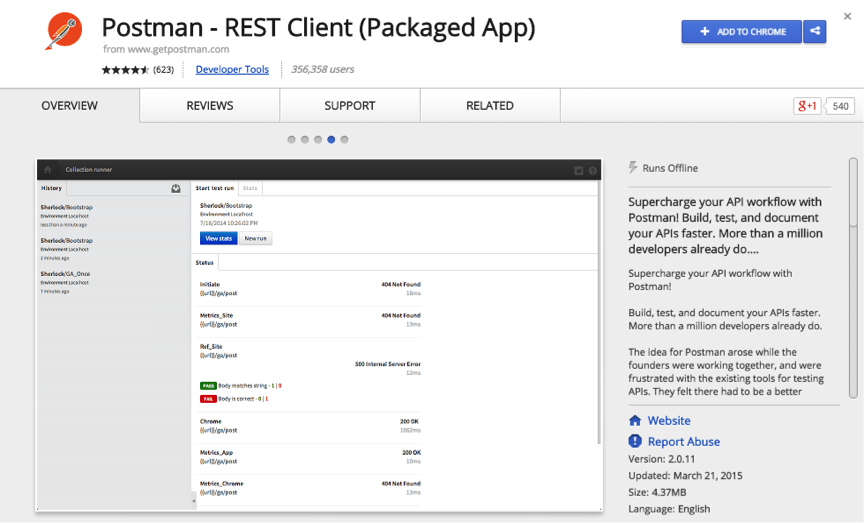

To launch Postman, open your chrome apps by clicking on the button to
the left of the browser.

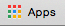

If the button isn’t there, you can use the ‘cmd-shift-B’ shortcut on
Mac, and the ‘ctrl-shift-B’ shortcut on windows.

Then, click on the Postman icon to launch the app.

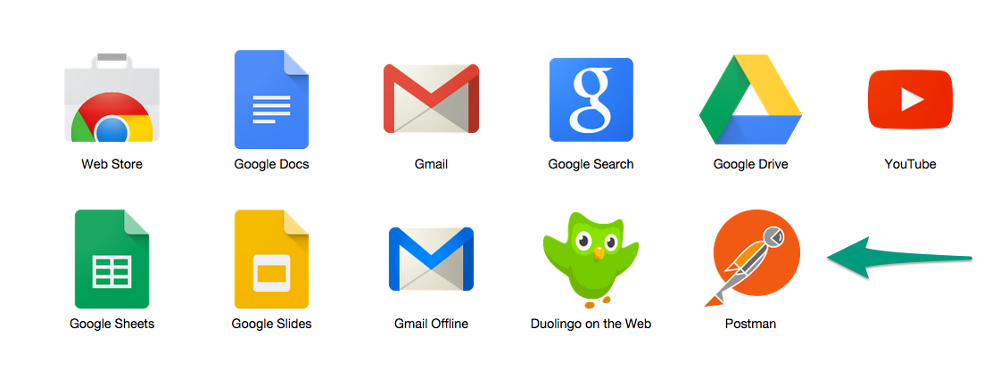

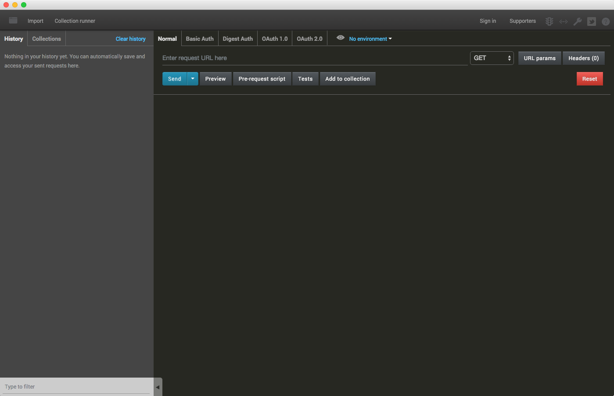Postman will then open in a new window, ready to
set up an environment.

Environments
------------

Setting up an environment allows us to easily use environmental
variables, which will make calling to the API easier, and quicker. To do
so, we click the downward arrow next to ‘No environment’ and select
‘Manage environments’

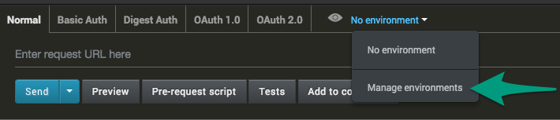

At the next window that opens, click ‘Add’.

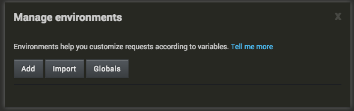

Make sure you name your environment ‘Demo’.

You will need to input the following keys and inputs:

|      Key      |               Value                    |
| ------------- | -------------------------------------- |
| url           | https://devapi.thecurrencycloud.com/v2 |
| login\_id     | [Use your login ID here]               |
| api\_key      | [Use your Unique API key here]         |
| auth\_token   | [Keep this empty]                      |

These keys are used throughout the API collection to automate the
process of making calls to the API. Your environment should look like
the following screenshot:

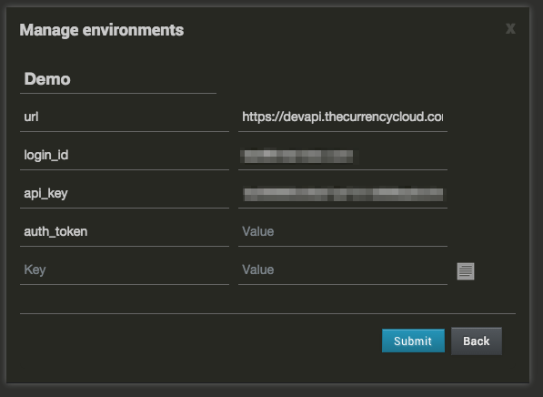

You are now ready to import the collection.

Collection
----------

Postman uses collections, which can be utilised to add groups of API
calls in order to automate the process of using our system. We provide
an official Postman collection for the Currency Cloud Demo API to help
get you testing as soon as possible.

To set up Postman with our collection, make sure that you are on the
collection tab on the left, and click ‘Import collection’

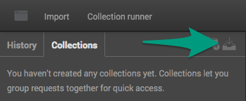

After that, select ‘Download from link’ and paste
the following URL into the box:
<https://www.getpostman.com/collections/43e4377fd2e9d187dd0e>.

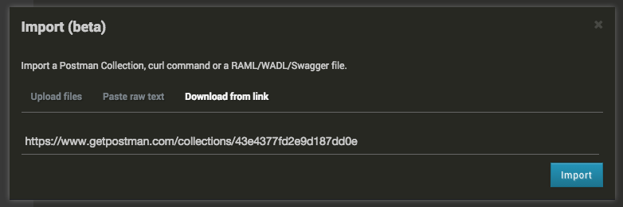

After clicking ‘import’ and closing the Import window, you should be
able to expand the list underneath collections to see all 12 API
categories, ready for use.

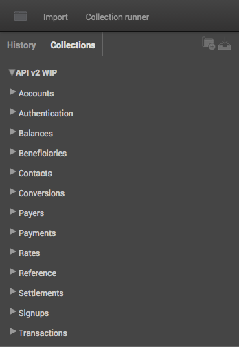

Using Postman
=============

Using Postman with the Currency Cloud API is the exact same as making
many manual HTTP requests, only easier. Lets go through some example API
calls so that you can get a feel for how it works with Postman.

Layout Explanation
------------------

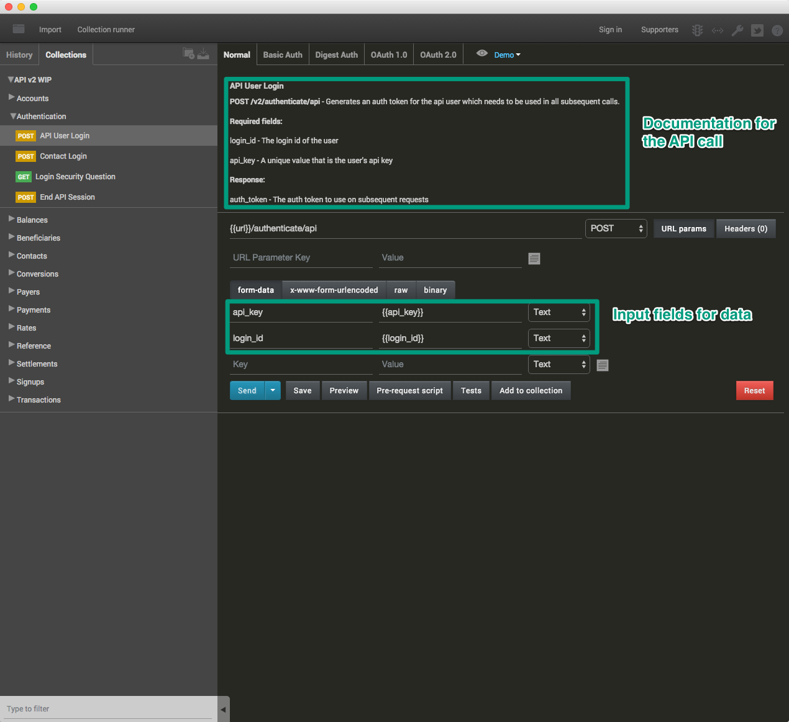

The documentation demonstrates what parameters to use with the selected
call, and explains what each of them is for. Some parameters are
required for a successful response, and some parameters are optional, in
order to change certain aspects or the API call and response. The
expected responses will also be described here, so that you know what
each call should return with.

1. Authenticate
---------------

Before we can use the API properly, you need to authenticate yourself.
The API will confirm that you are a valid user by matching you login ID
and your API key to each other, and return with an authentication token
if you are successfully authenticated. This token will be sent in the
header of all subsequent calls to the API. This token will automatically
expire after 30 minutes of inactivity, but it is good practise to
manually end the session.

To authenticate yourself, expand the Authentication folder under the
Collections tab, and select the API User Login call.

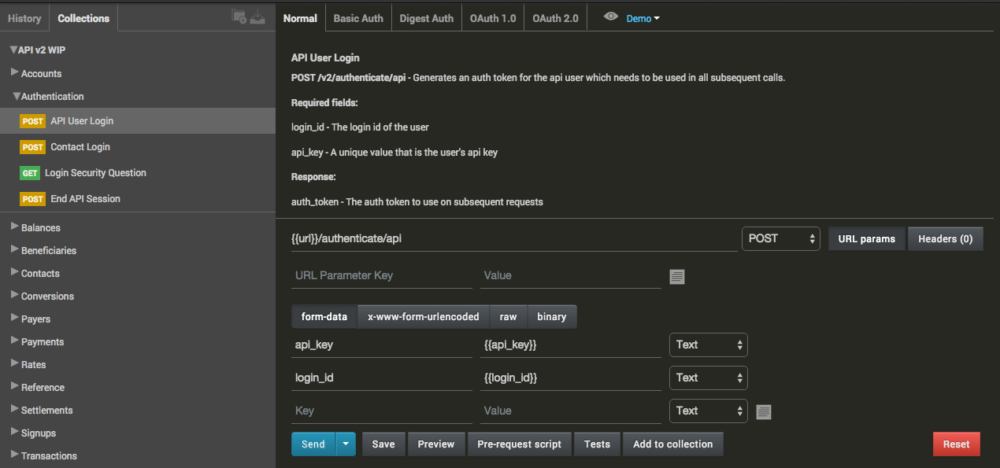

You may have noticed that some fields have already been filled out. The
Postman collection that we provide ensures that all required fields are
already there, ready for a value, to minimise that chance of an error
arising.

A word wrapped in double curly brackets, such as {{api\_key}} represents
a variable that we set up earlier. This makes the process of testing the
API much quicker and a lot less fiddly. Since we have already set up our
variables, all we have to do now is click ‘Send’ in order to receive our
Authentication token.

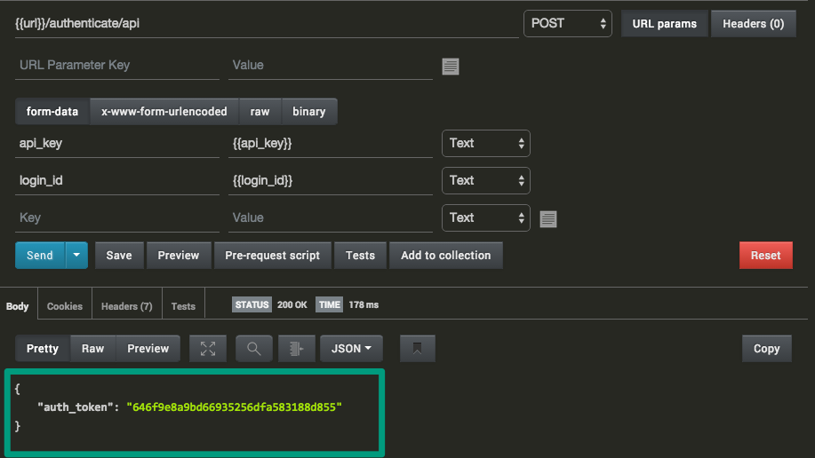

We have been given an authentication token to use in our API call
headers.

We are now going to quickly save this to a variable so that it is
automatically sent in every call from now on. To do this, highlight the
token with your mouse, right click and select ‘Set: Demo \>
auth\_token’. This will save the token as a variable, which is used
throughout the Postman collection. If you cannot see ‘Set : Demo’,
perhaps you named your environment something else during set up.

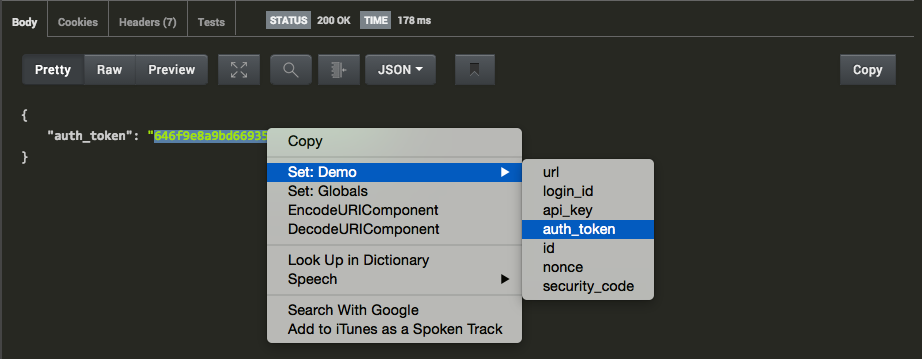

Authentication is now complete. If you have not managed to complete this
set, then it may be worth checking that the variables you set earlier
are correct. If they are, and you still cannot get authenticated,
contact support and try and get a new API key sent to you.

2. Getting a quote
------------------

Now that we are authenticated, we can start using the API properly. The
first thing that we will do is get some detailed information about a
specific trade that we might want to make. To do this, we are going to
use the ‘Detailed Rates’ call, nestled in the ‘rates’ folder under the
collections tab. The required parameters are already filled out with an
example trade, but we will tweak the values a bit to get a custom trade.
In this example, I will be looking to convert £1500GBP to €EUR. Here are
my tweaked parameters:

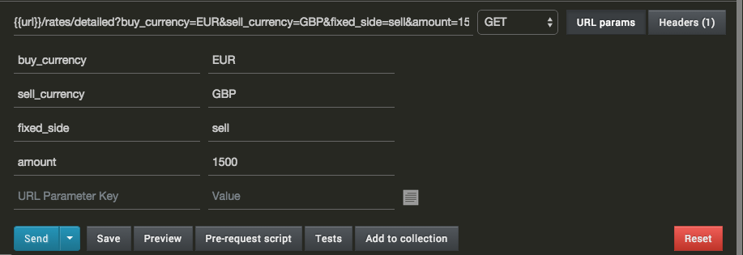

The fixed side is always set on the side of which there is a known
value. E.g. I am SELLing a known total of £1500, and finding it’s worth
in EUR, but I could be BUYing a known amount of EUR, and finding it’s
cost in GBP.

When I click ‘Send’, I get the following response:

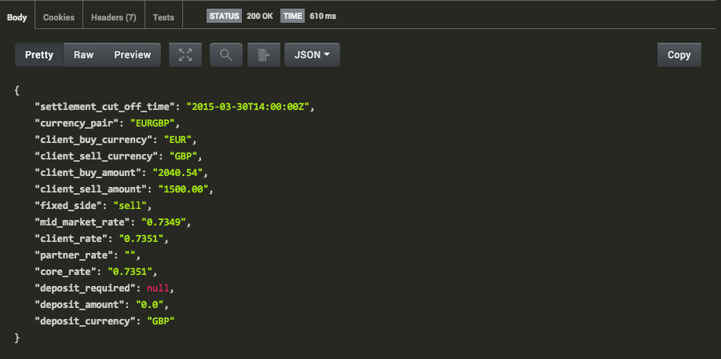

We can see the conversion pairing that I am querying, and various rates
for this pairing. If we were happy with this trade, we could then go
ahead and create a conversion, and then a payment, and send it to a
created beneficiary. I will cover these steps in this tutorial so that
you can really experience the potential for your business that our
service provides.

3. Making a Conversion
----------------------

Since we are happy with the current rates, we can now book a conversion.
To do this, we will be using the ‘Create a Conversion’ call, located in
the ‘Conversions’ folder, underneath the collections tab. I will be
making the conversion of the rates that we received a moment ago, with
the following settings:

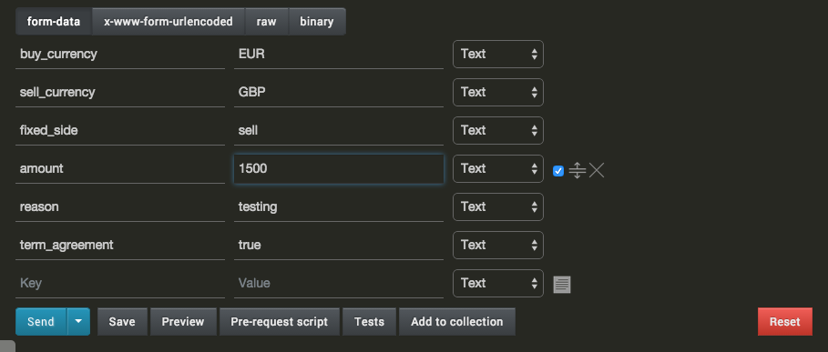  

Click ‘Send’ to send the API call. If you receive
an ‘auth\_failed’ error, then make sure that you have set your
auth\_token variable correctly. If you have, then re-authenticate and
use the new auth\_token and try again. You can easily go back to
re-attempt the call that we set up I the history tab, next to the
conversions tab on the left, which will let you choose a previous call
to send again.

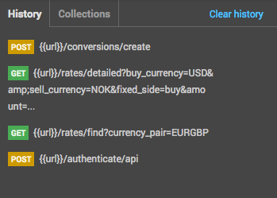

If everything worked properly, you will have a response similar to the
one below:

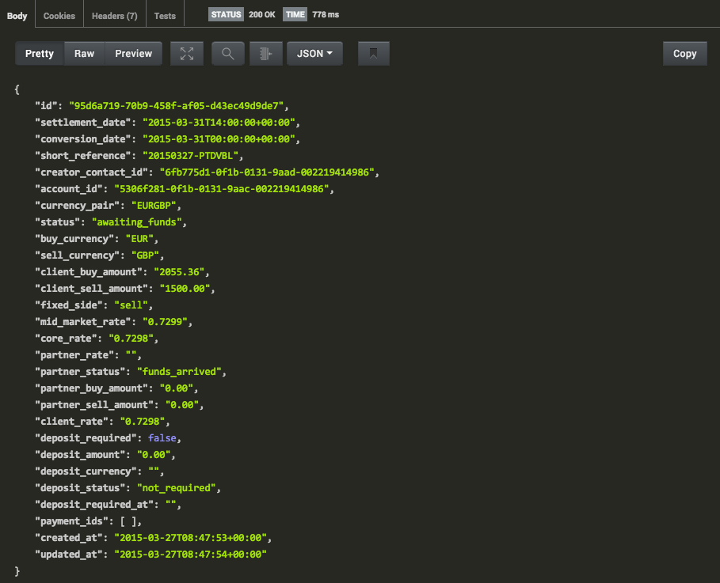

The conversion has been placed, but the money has not gone anywhere yet.
We must first create a beneficiary to which the funds shall be sent, and
then create a payment, so that the funds can be received by currency
cloud and then sent to the beneficiary. You may want to note down the id
value, as it will be used later during the payment call, either as a
variable in Postman as demonstrated during the setup of the environment,
or just copied into a text file for later use.

4. Create a Beneficiary
-----------------------

A beneficiary is the details of the recipient of
the funds when the trade is made. Different countries have different
ways of processing payments, so we must find what details are needed for
this trade. For this example we are going to be sending the funds to a
beneficiary in Germany. To find out what requirements for a payment to
be successfully processed in Germany are, we can use the ‘Beneficiary
Required Details’ call, located in the ‘Reference’ folder, underneath
the collections tab.

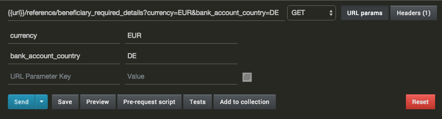

The Parameters we will be using is ‘currency’, which in this example is
‘EUR’, and also ‘bank\_account\_country’, which in this example is ‘DE’,
the country code for Germany.

The response we get from this is the following:

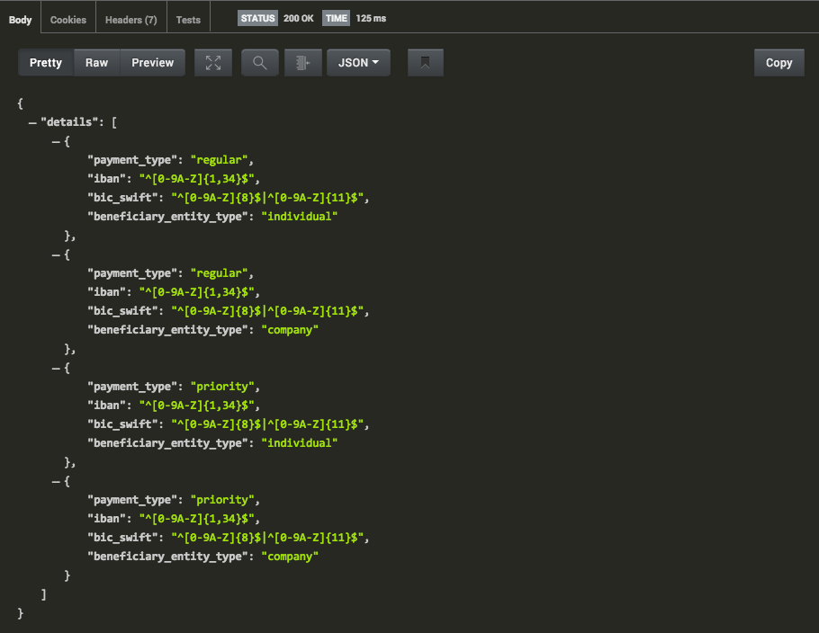

This shows the sort of information we will need for a beneficiary
depending on the type of payment it is. If we have these details then we
can proceed to create our beneficiary with the correct required
information.

Select the ‘Create Beneficiary’ call in the
‘Beneficiary’ folder underneath the collections tab. We can now apply
the parameters from the ‘Beneficiary Required Details’ call to correctly
create the beneficiary.  

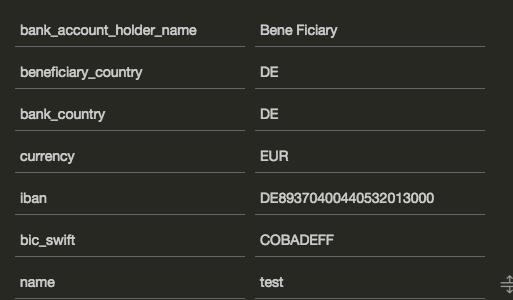

The response we get is the Beneficiary’s full details as it is stored:

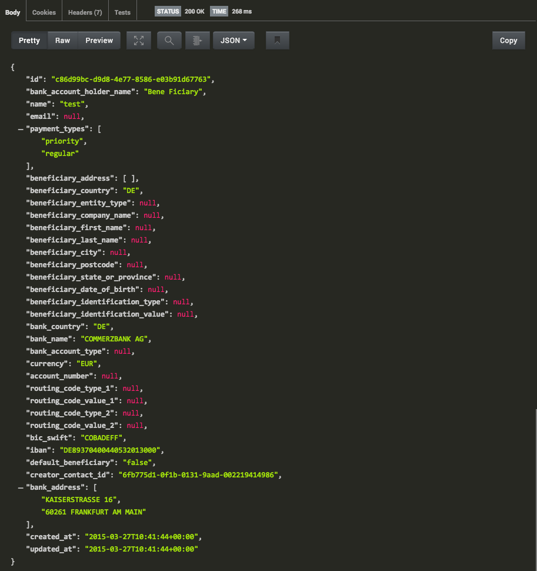

This is the beneficiary that we have created, and it can now be used in
a payment to direct money to the recipient. Once again, save the id
value somewhere so that we can use it in the payment call.

5. Make a Payment
-----------------

The final stage is to make a payment to the beneficiary that we have
just created, using the conversion that we made earlier on. To do this,
we use the 'Create a Payment' API call, located in the 'Payments' folder, 
underneath the collections tab. We fill in all of the required 
parameters, and add an optional parameter called 'conversion\_id' which
will hold the id of the conversion we made earlier on in this tutorial. 
Click 'Send' to complete the API call.

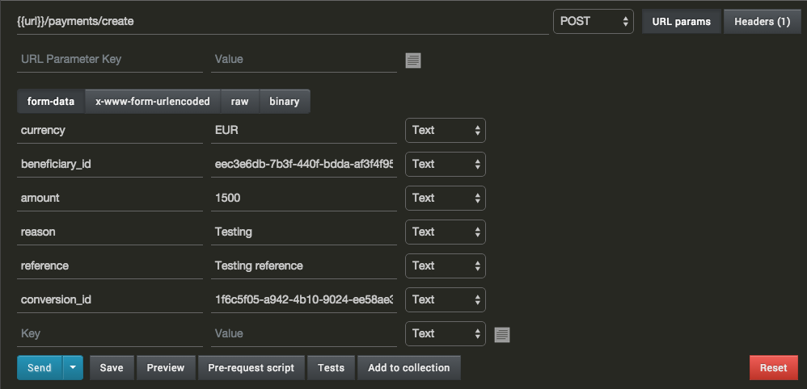

If the payment creation is successful, we will get a response that looks 
like the following:

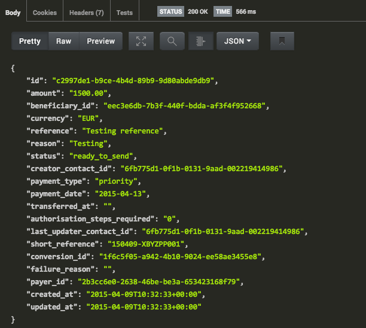

Success! We have used the Currency Cloud API to make a currency 
conversion using our detailed rates information, created a beneficiary
to whom the funds will be sent to, and finally, created a payment in 
order to finalise the process. 

Conclusion
==========

This is just a snippet of the full functionality of the Currency Cloud 
API. Now that you know the basics, why not give us a call and see how 
we can help integrate your business with our API.
